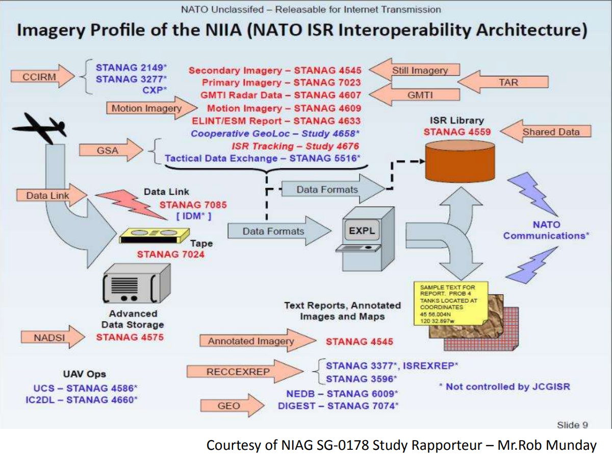

# Civilian standards

| TYPE                                 |  TITLE         | URL |
|--------------------------------------|----------------|-----|
| ARINC 429 PART 1                     | MARK 33 DIGITAL INFORMATION TRANSFER SYSTEM (DITS) PART 1 FUNCTIONAL DESCRIPTION, ELECTRICAL INTERFACE, LABEL ASSIGNMENTS AND WORD FORMATS | [¹](https://toddheffley.com/wordpress/wp-content/uploads/2014/07/Arinc429WordList-copy.pdf) |
| ARINC 600-20                         | AIR TRANSPORT AVIONICS EQUIPMENT INTERFACES                                                       | [¹](https://studylib.net/doc/25619567/air-transport-avionics-equipment-interfaces---arinc-sp%C3%A9ci...) |
| ARINC 615-4                          | AIRBORNE COMPUTER HIGH SPEED DATA LOADER                                                          | |
| ARINC 615A-4                         | SOFTWARE DATA LOADER USING ETHERNET INTERFACE                                                     | |
| ARINC 618-6                          | AIR/GROUND CHARACTER-ORIENTED PROTOCOL SPECIFICATION                                              | |
| ARINC 619-3                          | ACARS PROTOCOLS FOR AVIONIC END SYSTEMS                                                           | |
| ARINC 651-1                          | DESIGN GUIDANCE FOR INTEGRATED MODULAR AVIONICS                                                   | |
| ARINC 653 Part 1-2                   | AVIONICS APPLICATION SOFTWARE STANDARD INTERFACE PART 1 – REQUIRED SERVICES                       | [¹](https://mail.kia.prz.edu.pl/~ssamolej/vxworks/ARINC_653P1-2.pdf) |
| ARINC 664 Part 7                     | AIRCRAFT DATA NETWORK PART 7 AVIONICS FULL DUPLEX SWITCHED ETHERNET (AFDX) NETWORK                | [¹](https://mail.kia.prz.edu.pl/~ssamolej/vxworks/ARINC_664P7.pdf) |
| ARINC 818-3                          | AVIONICS DIGITAL VIDEO BUS (ADVB) HIGH DATA RATE                                                  | |
| ARINC 826                            | SOFTWARE DATA LOADER USING CAN INTERFACE                                                          | |
| ARINC 838                            | LOADABLE SOFTWARE PART DEFINITION FORMAT                                                          | |
| SAE AS6802                           | TIME-TRIGGERED ETHERNET                                                                           | |
| SAE <b>ARP4754B</b> / EUROCAE ED-79B | Guidelines for Development of Civil Aircraft and Systems                                          | |
| SAE ARP4761A / EUROCAE ED-135A       | Guidelines for Conducting the Safety Assessment Process on Civil Aircraft, Systems, and Equipment | |
| SAE ARP5151A                         | Safety Assessment of General Aviation Airplanes and Rotorcraft in Commercial Service              | |
| SAE ARP6983 / EUROCAE ED-324         | Process Standard for Development and Certification/Approval of Aeronautical Safety-Related Products Implementing ML | |
| RTCA <b>DO-178C</b> / EUROCAE ED-12C | Software Considerations in Airborne Systems and Equipment Certification                           | |
| RTCA <b>DO-248C</b> / EUROCAE ED-94C | Supporting Information for DO-178C / ED-12C and DO-278A / ED-109A                                 | |
| RTCA DO-254 / EUROCAE ED-80          | Design Assurance Guidance for Airborne Electronic Hardware                                        | |
| RTCA DO-297 / EUROCAE ED-124         | Integrated Modular Avionics (IMA) Development Guidance and Certification Considerations           | |
| RTCA DO-326A / EUROCAE ED-202A       | Airworthiness Security Process Specification                                                      | |
| RTCA DO-330 / EUROCAE ED-215         | Software Tool Qualification Considerations                                                        | |

# NATO standards

## Avionics related

| TYPE        |  TITLE         | URL |
|-------------|----------------|-----|
| STANAG 3838 / MIL-STD-1553 ('MIL-Bus') | DIGITAL TIME DIVISION COMMAND/RESPONSE MULTIPLEX DATA BUS - AAVSP-03 EDITION A | MIL-STD-1553[¹](https://quicksearch.dla.mil/qsDocDetails.aspx?ident_number=36973) [²](MIL-STD/MIL-STD-1553C.pdf) |
| MIL-STD-1773 | Fiber Optics Mechanization of an Aircraft Internal Time Division Command/Response Multiplex Data Bus | [¹](https://quicksearch.dla.mil/qsDocDetails.aspx?ident_number=37131) [²](MIL-STD/MIL-STD-1773.pdf) |
| STANAG 3910 ('EFABus') | HIGH SPEED DATA TRANSMISSION UNDER STANAG 3838 AVS OR FIBRE OPTIC EQUIVALENT CONTROL | |
| STANAG 4452 | GUIDANCE ON SOFTWARE SAFETY DESIGN AND ASSESSMENT OF MUNITION-RELATED COMPUTING SYSTEMS | AOP-52[¹](https://www.cto.mil/wp-content/uploads/2025/08/AOP-52-EDB-V1E.pdf) [²](AOP/AOP-52-EDB-V1E.pdf) |
| STANAG 4586 | STANDARD INTERFACES OF UA CONTROL SYSTEM (UCS) FOR NATO UA INTEROPERABILITY    | [¹](https://nso.nato.int/nso/nsdd/main/standards?search=4586) AEP-84[²](AEP/AEP-84_VOLI_EDA_V1_E.pdf) |
| STANAG 4626 | MODULAR AND OPEN AVIONICS ARCHITECTURES PART I/II - ARCHITECTURE/SOFTWARE               | [¹](http://everyspec.com/NATO/NATO-STANAG/STANAG_4626_part_I_DRAFT-1_Architecture_6299/) |
| STANAG 4671 | UNMANNED AIRCRAFT SYSTEMS AIRWORTHINESS REQUIREMENTS (USAR)                     | [¹](https://nso.nato.int/nso/nsdd/main/standards?search=4671) AEP-4671[²](AEP/AEP-4671_EDB_V1_E.pdf) |
| STANAG 4703 | LIGHT UNMANNED AIRCRAFT SYSTEMS AIRWORTHINESS REQUIREMENTS                              | [¹](https://nso.nato.int/nso/nsdd/main/standards?search=4703) AEP-83[²](AEP/AEP-83_EDC_V1_E.pdf) |
| STANAG 4811 | SENSE AND AVOID FOR UNMANNED AIRCRAFT SYSTEMS - AEP-107 EDITION B                       | [¹](https://nso.nato.int/nso/nsdd/main/standards?search=4811) |

### Network

| TYPE          |  TITLE         |
|---------------|----------------|
| MIL-STD-3011  | JOINT RANGE EXTENSION APPLICATION PROTOCOL (JREAP)             |
| MIL-STD-6011  | TACTICAL DATA LINK (TDL) 11/11B MESSAGE STANDARD (LINK-11)     |
| MIL-STD-6016  | TACTICAL DATA LINK (TDL) 16 MESSAGE STANDARD (LINK-16)         |

## ISR related[¹](https://www.aofs.org/wp-content/uploads/2013/10/131010.08-Gemma-GMSpazio.pdf)

# US military standards

| TYPE          |  TITLE         |  URL |
|---------------|----------------|------|
| RCC 466-15    | AIRBORNE NETWORK CAMERA STANDARD                 | [¹](https://www.trmc.osd.mil/wiki/download/attachments/113019941/466-15_Airborne_Network_Camera_Standard.pdf?api=v2) [²](RCC/466-15_Airborne_Network_Camera_Standard.pdf)
| MIL-STD-704F   | ELECTRIC POWER, AIRCRAFT, CHARACTERISTICS AND UTILIZATION OF | [¹](https://rfimmunity.com/wp-content/uploads/2017/04/MIL-STD-704.pdf) [²](MIL/MIL-STD-704.pdf) |
| MIL-STD-882E  | SYSTEM SAFETY PROGRAM REQUIREMENTS               | [¹](https://www.nde-ed.org/NDEEngineering/SafeDesign/MIL-STD-882E.pdf) [²](MIL-STD/MIL-STD-882E.pdf) |
| MIL-STD-1760F | AIRCRAFT/STORE ELECTRICAL INTERCONNECTION SYSTEM | [¹](https://quicksearch.dla.mil/qsDocDetails.aspx?ident_number=37120) [²](MIL-STD/MIL-STD-1760.pdf) |

# Outdated standards

| TYPE          |  TITLE         |    Succeeded by    |
|---------------|----------------|--------------------|
| DOD-STD-2167A | Defense Systems Software Development      | MIL-STD-498 / RTCA DO-178 |
| DOD-STD-2168  | Defense System Software Quality Program   | MIL-STD-498 / RTCA DO-178 |
| MIL-STD-498   | Military Standard Software Development and Documentation | RTCA DO-178 |
